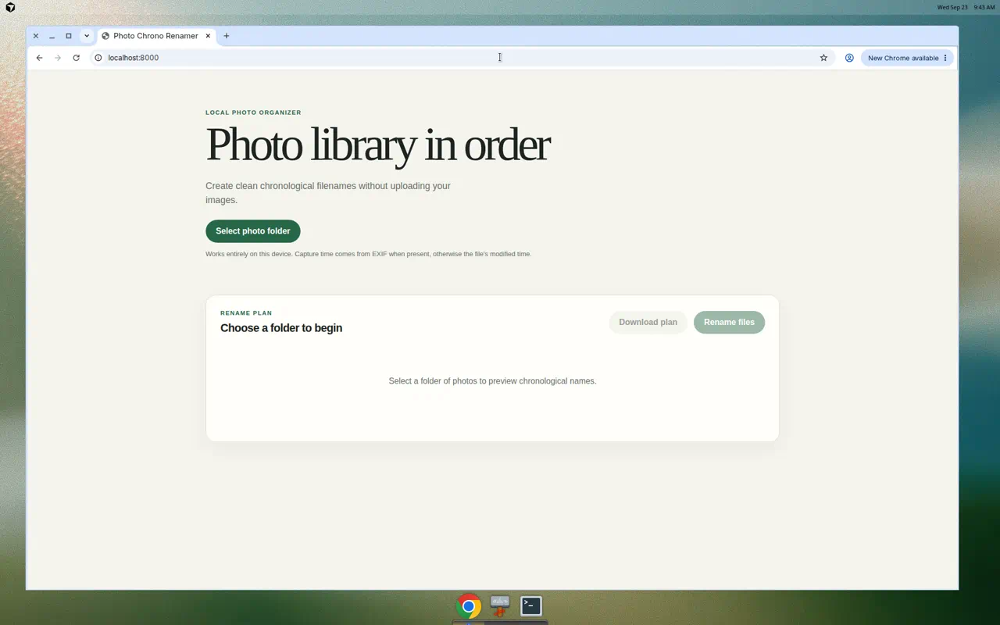
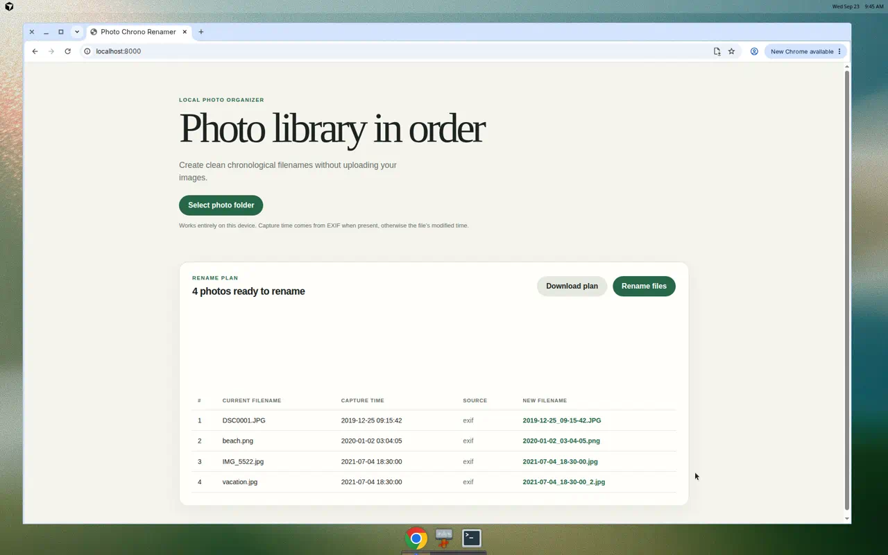

# Tutorial: Using Photo Chrono Renamer

This tutorial walks you through renaming a folder of photos into clean,
chronological filenames. Nothing is uploaded — every photo is read and renamed
on your own computer.

By the end you will have renamed messy filenames like `IMG_5522.jpg` and
`DSC0001.JPG` into sorted, readable names like `2019-12-25_09-15-42.JPG`.

## What the tool does

It sorts the images in one folder by capture time and renames them to:

```text
YYYY-MM-DD_HH-MM-SS.ext
YYYY-MM-DD_HH-MM-SS_2.ext   # when that name is already taken
```

Capture time is taken from the first available source:

1. EXIF `DateTimeOriginal`
2. EXIF `DateTimeDigitized`
3. XMP `DateTimeOriginal` or `CreateDate`
4. EXIF `DateTime`
5. File birth (creation) time, when the filesystem provides one
6. File modification time

Supported file types: `jpg`, `jpeg`, `png`, `heic`, `heif`, `webp`, `tif`, `tiff`.
Only files directly inside the chosen folder are renamed — subfolders are left
alone.

You can use it two ways: the **command line** or the **browser page**. Pick
whichever you prefer; both produce the same names.

---

## Option A: Command line

Best when you are comfortable with a terminal or want to script it.

### 1. Install the prerequisite

You only need [Node.js](https://nodejs.org/) 18 or newer. There is no separate
install step for the tool itself. Check your version:

```bash
node --version
```

### 2. Get the code

```bash
git clone https://github.com/himadri-mohan/photo-chrono-renamer.git
cd photo-chrono-renamer
```

### 3. Preview the plan (safe — changes nothing)

Point the tool at your photo folder. By default it only *prints* what it would
do, so you can review it first:

```bash
node cli.js /path/to/your/photos
```

Example output for a folder containing `IMG_5522.jpg`, `DSC0001.JPG`,
`beach.png`, `vacation.jpg`, and a `notes.txt`:

```text
Dry run only. No files were changed.
/path/to/your/photos

DSC0001.JPG -> 2019-12-25_09-15-42.JPG  [exif 2019-12-25 09:15:42]
beach.png -> 2020-01-02_03-04-05.png  [exif 2020-01-02 03:04:05]
IMG_5522.jpg -> 2021-07-04_18-30-00.jpg  [exif 2021-07-04 18:30:00]
vacation.jpg -> 2021-07-04_18-30-00_2.jpg  [exif 2021-07-04 18:30:00]

4 to rename, 0 already named correctly. Re-run with --apply to rename.
```

How to read a line:

```text
DSC0001.JPG -> 2019-12-25_09-15-42.JPG  [exif 2019-12-25 09:15:42]
 current name    new name                source  capture time used
```

Notice that `vacation.jpg` and `IMG_5522.jpg` share the same capture time, so
the second one gets a `_2` suffix instead of overwriting the first. The
`notes.txt` file is not an image, so it is ignored and left untouched.

### 4. Apply the renames

When the plan looks right, add `--apply` to actually rename the files in place:

```bash
node cli.js /path/to/your/photos --apply
```

```text
Applying renames.
/path/to/your/photos

DSC0001.JPG -> 2019-12-25_09-15-42.JPG  [exif 2019-12-25 09:15:42]
beach.png -> 2020-01-02_03-04-05.png  [exif 2020-01-02 03:04:05]
IMG_5522.jpg -> 2021-07-04_18-30-00.jpg  [exif 2021-07-04 18:30:00]
vacation.jpg -> 2021-07-04_18-30-00_2.jpg  [exif 2021-07-04 18:30:00]

Renamed 4 files.
```

Your folder now contains the sorted names:

```text
2019-12-25_09-15-42.JPG
2020-01-02_03-04-05.png
2021-07-04_18-30-00.jpg
2021-07-04_18-30-00_2.jpg
notes.txt
```

### 5. Re-run any time (it is safe)

Running it again does nothing because the files are already named correctly.
Existing files are never overwritten:

```text
0 to rename, 4 already named correctly. Re-run with --apply to rename.
```

### Command reference

```text
node cli.js <folder>            Preview the rename plan (no changes)
node cli.js <folder> --apply    Rename the files in place
node cli.js --help              Show usage
```

---

## Option B: Browser page

Best if you prefer a point-and-click interface. Renaming in place works in
**Chrome or Edge**. Other browsers (including Safari) can still preview the plan
and download it as a CSV.

### 1. Open the page

Open `index.html` directly in Chrome or Edge, or serve the folder with any
static file server and visit it:

```bash
# from the project folder
python3 -m http.server 8000
# then open http://localhost:8000 in Chrome or Edge
```

You will see the landing page with a **Select photo folder** button.



### 2. Choose your photo folder

Click **Select photo folder** and pick the folder of photos in the dialog. When
the browser asks for permission to view (and later edit) the files, allow it.

### 3. Review the plan

The page fills a table showing each current filename, the capture time it read,
where that time came from, and the proposed new filename. This is a preview —
nothing has changed yet.



### 4. Rename or export

- **Rename files** applies the plan to the folder you selected (Chrome or Edge).
- **Download plan** saves the table as a CSV so you can keep a record or use it
  elsewhere. This works in any browser.

---

## Tips and good to know

- **Preview first.** On the command line, always run without `--apply` first. In
  the browser, the table is always a preview until you click **Rename files**.
- **Nothing is overwritten.** If a target name already exists, the tool adds
  `_2`, `_3`, and so on.
- **Only the selected folder.** Files inside subfolders are not touched.
- **No EXIF? No problem.** Photos without an embedded date fall back to the
  file's creation time, then its modified time. Creation time is available on
  macOS and Windows; Linux usually uses the modified time.
- **Privacy.** Photos are read and renamed locally. Nothing is uploaded.

## Troubleshooting

- **"Could not read folder"** — the path is wrong or unreadable. Check the folder
  path you passed on the command line.
- **The browser button does nothing / no folder dialog** — you are likely in
  Safari or Firefox, which cannot rename in place. Use Chrome or Edge, or use the
  **Download plan** button to export a CSV.
- **A photo shows an unexpected time** — it probably has no EXIF date, so a file
  timestamp was used. The `[source ...]` label in the plan tells you which time
  was used (`exif`, `xmp`, `birthtime`, or `mtime`).

## See also

- [`README.md`](README.md) — overview, time-source details, and deployment.
